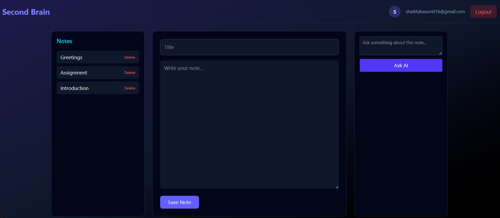
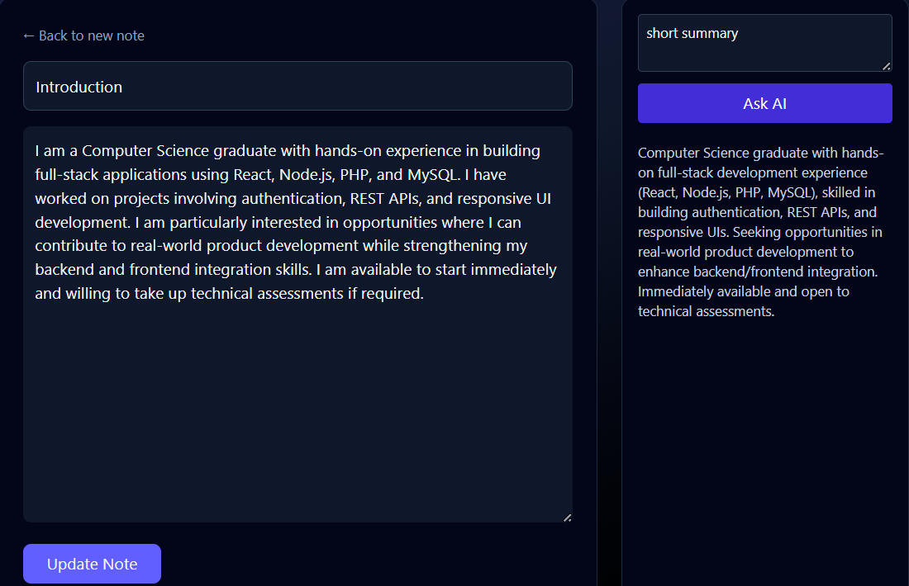

# 🧠 Second Brain – AI-Powered Smart Notes App

Second Brain is a full-stack AI-powered notes application that allows users to create, manage, and interact with their notes using Google Gemini AI.

It combines structured note-taking with intelligent content assistance such as summarization, rewriting, and contextual Q&A.

---

## 🚀 Live Demo

🔗 [Click to view live](https://notes-izopt8u34-sumayyas-projects-6c5328d0.vercel.app/)

---

## ✨ Features

- 🔐 Secure authentication (Supabase Auth)
- 📝 Create, update, and delete notes
- 📚 Auto-sorted notes (latest first)
- 🤖 AI-powered assistant (Google Gemini)
  - Summarize notes
  - Improve writing
  - Generate optimized versions
  - Ask contextual questions
- ⚡ Real-time AI responses via server-side API route
- 🎨 Clean responsive UI (Next.js + Tailwind CSS)

---

## 🏗️ Tech Stack

### Frontend

- Next.js (App Router)
- React (Client Components)
- Tailwind CSS
- Framer Motion

### Backend

- Next.js API Routes
- Google Gemini API (v1)
- Supabase (Postgres + Auth)

### Deployment

- Vercel (Serverless Functions)
- Supabase Cloud

---

# 🧠 Second Brain – AI-Powered Smart Notes App

Second Brain is a full-stack AI-powered notes application that allows users to create, manage, and interact with their notes using Google Gemini AI.

It combines structured note-taking with intelligent content assistance such as summarization, rewriting, and contextual Q&A.

---

## 🚀 Live Demo

🔗 https://your-vercel-link.vercel.app

---

## ✨ Features

- 🔐 Secure authentication (Supabase Auth)
- 📝 Create, update, and delete notes
- 📚 Auto-sorted notes (latest first)
- 🤖 AI-powered assistant (Google Gemini)
  - Summarize notes
  - Improve writing
  - Generate optimized versions
  - Ask contextual questions
- ⚡ Real-time AI responses via server-side API route
- 🎨 Clean responsive UI (Next.js + Tailwind CSS)

---

## 🏗️ Tech Stack

### Frontend

- Next.js (App Router)
- React (Client Components)
- Tailwind CSS
- Framer Motion

### Backend

- Next.js API Routes
- Google Gemini API (v1)
- Supabase (Postgres + Auth)

### Deployment

- Vercel (Serverless Functions)
- Supabase Cloud

---

## 🧠 Architecture

### AI Flow

User → Frontend (Next.js) → /api/ai → Gemini API → Response → UI

### Notes System

User → Supabase Auth → Postgres Database → UI

## Notes Storage:

- Supabase Postgres + Auth

---

## 🔑 Environment Variables

- Create a `.env.local` file:
- GEMINI_API_KEY=your_gemini_key
- NEXT_PUBLIC_SUPABASE_URL=your_supabase_url
- NEXT_PUBLIC_SUPABASE_ANON_KEY=your_supabase_anon_key

⚠️ Do NOT commit `.env.local`

---

## 🛠️ Installation

Clone the repository:

git clone https://github.com/your-username/second-brain.git

cd second-brain
npm install
npm run dev

Visit:

http://localhost:3000

---

## 📸 Screenshots

### Dashboard

### AI Interaction

---

## 🎯 Why This Project?

This project demonstrates:

- Full-stack architecture using modern React patterns
- Secure authentication and database integration
- Server-side API proxy for AI model integration
- Environment variable management
- Clean UI/UX design with responsive layout

---

## 🔮 Future Improvements

- Flashcard generation mode
- Interview question generator
- Note tagging and search
- Markdown support
- AI writing modes dropdown

---

## 📄 License

MIT License
